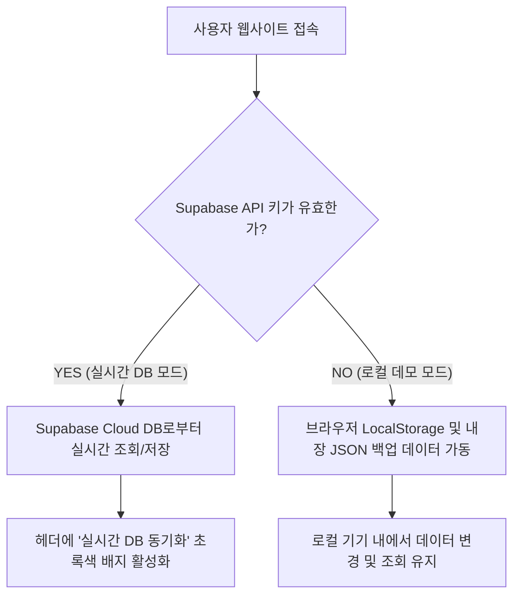

# 🌿 [템플릿 1] 모임 주소록 웹앱 전체 개요 및 아키텍처

나중에 유사한 친목 모임, 동창회, 동호회용 주소록 및 모임 일정 관리 웹앱을 구축할 때 뼈대로 삼을 전체 기획 및 데이터 흐름 설계도입니다.

---

## 📌 1. 서비스 정의 및 활용 시나리오
* **주요 타겟**: 50명 ~ 100명 내외의 친목 모임, 청년회, 소규모 협회 등
* **플랫폼 최적화**: 스마트폰 모바일 화면(가로폭 480px 이하)에 최적화된 모바일 전용 반응형 레이아웃
* **주요 기능**:
  * **주소록 탭**: 부서/직책별 필터링, 통합 스마트 검색, 전화/문자 즉시 연결, 임원 3D 카드, 공식 회비/상조 계좌번호 원터치 복사 위젯
  * **모임 일정 탭**: 다음 약속까지 남은 기간 실시간 D-Day 카운팅, 가장 다가올 최근 일정 하이라이트 표시, 1부(회의)/2부(식사) 분할 지도 길찾기 연동
  * **관리자 탭**: 회원 정보 추가/수정/삭제, 모임 일정 추가/수정/삭제, 집행부(회장, 총무, 재무) 즉시 지명 및 직책 스왑 기능, 공식 회비 계좌 정보 변경

---

## 🔄 2. 이중 하이브리드 데이터 흐름 설계
이 템플릿의 가장 강력한 특징은 **데이터베이스가 켜져 있을 때(실시간 DB 모드)와 꺼져 있을 때(로컬 데모 모드) 모두 호환되어 무조건 앱이 켜지도록 설계된 안정적 이중구조**입니다.

### 1) 실시간 DB 모드 (Supabase)
* `.env` 파일에 Supabase URL과 Anon Key가 올바르게 기입된 상태일 때 활성화됩니다.
* 관리자가 회원 정보를 수정하거나 계좌번호를 바꾸는 순간, DB 서버에 즉각 반영되어 접속 중인 다른 모든 회원의 화면에도 실시간으로 정보가 동기화되어 나타납니다.

### 2) 로컬 데모 모드 (LocalStorage & Local JSON)
* Supabase 연결 설정이 되어 있지 않거나 DB 서버가 일시 마비되었을 때 백업용으로 자동 활성화됩니다.
* `src/data/members.json` 에 정의해 둔 초기 기본 데이터로 앱이 실행되며, 수정/추가한 모든 정보는 브라우저의 `localStorage` 공간에 안전하게 저장되어 기기 내부에서 영속성이 보장됩니다.
